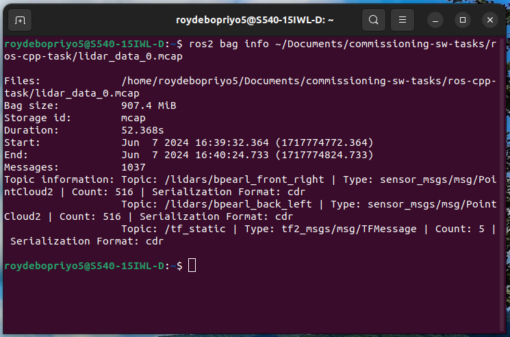
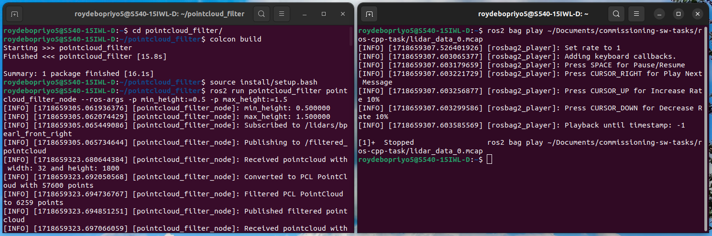
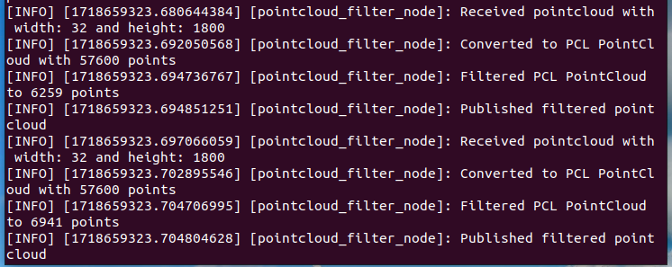
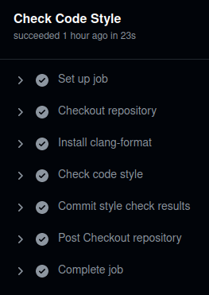

# LiDAR PointCloud Filter
_ROS2 node that can filter the pointcloud of a 3D LiDAR by height_

## Features
- Get parameters for minimum and maximum height, and remove any points outside range.
- Subscribes and publishes to topics of type `sensor_msgs/PointCloud2`.
- Converts message from PointCloud2 to PCL PointCloud, filters 'z' coordinate (height), and converts back to PointCloud2 followed by publishing in new topic.

## Prerequisites
- Ubuntu 22.04.4 LTS
- ROS Iron Irwini
- Point Cloud Library
- clang-format

## Setup

1. **Clone the repository:**

    ```sh
    git clone https://github.com/roydebopriyo5/pointcloud_filter.git
    ```

2. **Download lidar data:**

    [lidar_data_0.mcap](https://drive.google.com/file/d/1rVA9ABztdQk02htZvDYbMPLIlFQj7dTz/view?usp=sharing)

3. **Build package and Source:**

    ```sh
    cd pointcloud_filter/
    colcon build
    source install/setup.bash
    ```

## Execute

1. **Add sourcing:**

    ```sh
    echo "source /opt/ros/iron/setup.bash" >> ~/.bashrc
    ```

2. **Run:**

    - _Open a terminal to start the filter node_

    ```sh
    cd pointcloud_filter/
    ros2 run pointcloud_filter pointcloud_filter_node --ros-args -p min_height:=0.5 -p max_height:=1.5
    ```

    Change the height values as required.

    - _Open another terminal to play the pointcloud data_

    ```sh
    ros2 bag play ~/Documents/commissioning-sw-tasks/ros-cpp-task/lidar_data_0.mcap
    ```

    Provide the path to the pointcloud data file as per stored in the system.

    This will filter the pointcloud data by height ('z' coordinate), removing any points outside the specified height range.

## Example screenshots

_Considering topic `/lidars/bpearl_front_right`_



_Testing node_



_Output logs_



The messages indicate:
- Successfully converts incoming PointCloud2 to PCL format containing points.
- Filtered the original pointcloud based on specified height range, resulting in points that meet the criteria.
- Publishes the filtered pointcloud in new topic.

The messages repeat indicating that the node is continously receiving new pointcloud messages. The node will spin as long as the pointcloud data is played using the bag.

## CI pipeline
_To check the code style whenever pushing new changes to the git repository_



